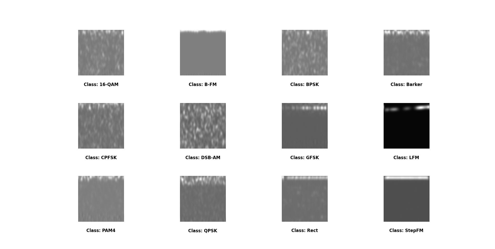
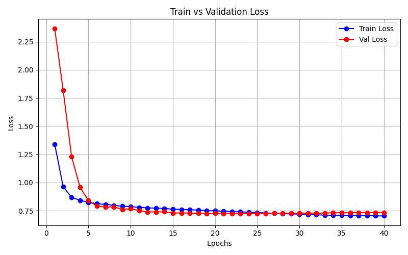
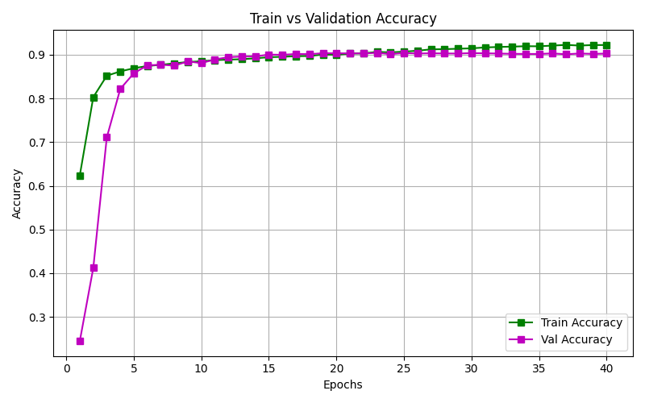
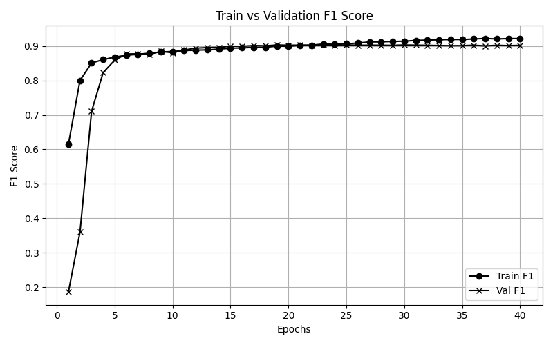
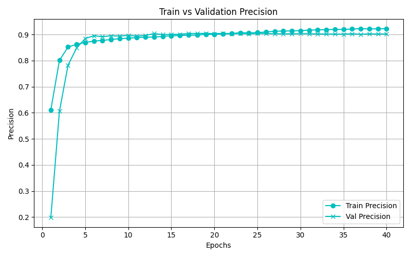
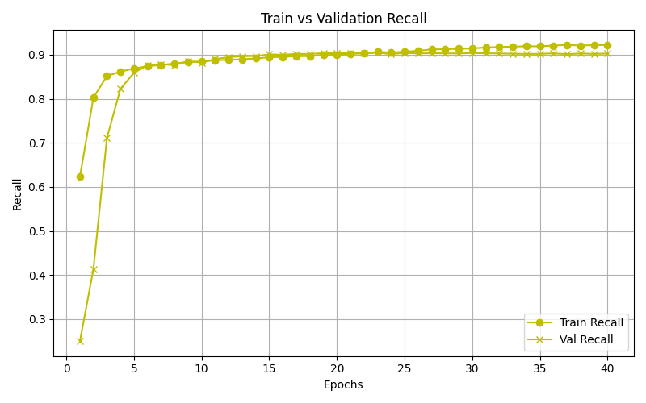
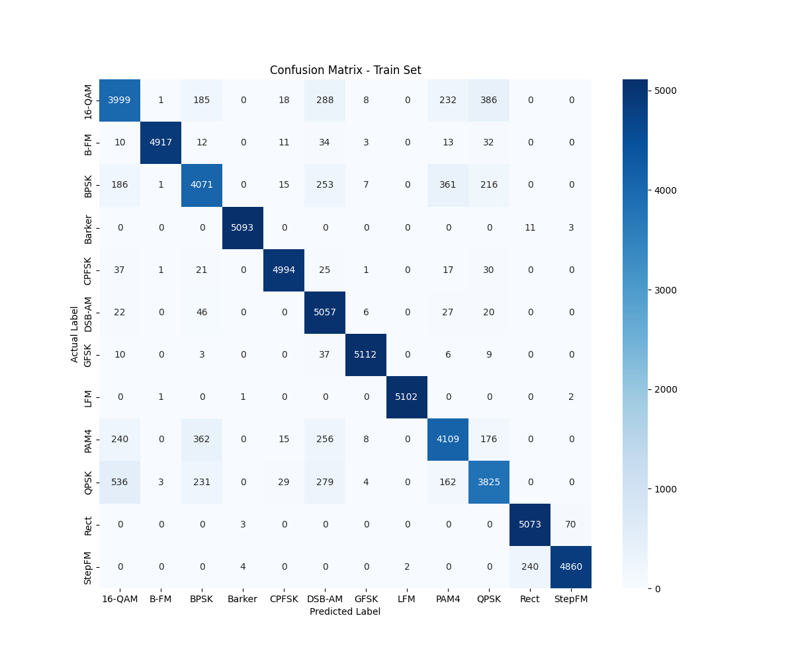
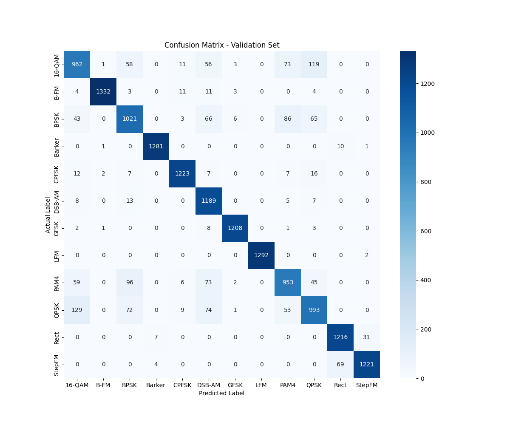

# A Lightweight CNN Architecture for Automatic Radio Frequency Signal Recognition

## Abstract
This project develops an automated system for identifying Radio Frequency (RF) and radar signals, a critical task in modern spectrum monitoring. By transforming raw RF signals into time-frequency spectrogram images, the recognition problem is effectively addressed using computer vision techniques. We propose a lightweight Convolutional Neural Network (CNN) architecture optimized with fewer than 100,000 trainable parameters, ensuring feasibility for deployment on resource-constrained edge devices. The model was trained and evaluated on a diverse dataset of 12 signal classes, achieving high accuracy while strictly adhering to technical constraints regarding model architecture and system output formats.

## Download Dataset
* **Training Set:** [Kaggle - Radar Common Signal Data Train](https://www.kaggle.com/datasets/hoangcat/radar-common-signal-data-train)
* **Test Set:** [Kaggle - Radar Common Signal Data Test](https://www.kaggle.com/datasets/hoangcat/radar-common-signal-data-test)

## Datasets
The dataset consists of 12 different radio frequency signal classes, represented as $224 \times 224$ grayscale spectrogram images.

### Signal Samples

## Data Statistics
| Class | snr01 | snr02 | snr03 | snr04 | snr05 | snr06 | snr07 | snr08 | **Total Instances** | **Image Size** |
| :--- | :---: | :---: | :---: | :---: | :---: | :---: | :---: | :---: | :---: | :---: |
| **16-QAM** | 858 | 769 | 796 | 843 | 789 | 798 | 758 | 789 | **6,400** | $224 \times 224$ |
| **B-FM** | 778 | 761 | 791 | 823 | 832 | 789 | 785 | 841 | **6,400** | $224 \times 224$ |
| **BPSK** | 828 | 781 | 812 | 838 | 793 | 783 | 788 | 777 | **6,400** | $224 \times 224$ |
| **Barker** | 789 | 816 | 751 | 819 | 822 | 816 | 784 | 803 | **6,400** | $224 \times 224$ |
| **CPFSK** | 776 | 780 | 787 | 820 | 828 | 792 | 829 | 788 | **6,400** | $224 \times 224$ |
| **DSB-AM** | 813 | 755 | 804 | 785 | 822 | 802 | 805 | 814 | **6,400** | $224 \times 224$ |
| **GFSK** | 789 | 834 | 792 | 777 | 816 | 794 | 800 | 798 | **6,400** | $224 \times 224$ |
| **LFM** | 771 | 810 | 768 | 815 | 773 | 819 | 808 | 836 | **6,400** | $224 \times 224$ |
| **PAM4** | 794 | 822 | 815 | 782 | 802 | 783 | 831 | 771 | **6,400** | $224 \times 224$ |
| **QPSK** | 799 | 802 | 811 | 757 | 837 | 854 | 733 | 807 | **6,400** | $224 \times 224$ |
| **Rect** | 787 | 794 | 810 | 802 | 814 | 777 | 829 | 787 | **6,400** | $224 \times 224$ |
| **StepFM** | 789 | 818 | 744 | 837 | 803 | 804 | 782 | 823 | **6,400** | $224 \times 224$ |
| **Total** | **9,580** | **9,542** | **9,481** | **9,700** | **9,733** | **9,611** | **9,532** | **9,624** | **76,800** | - |

> **Note:** The dataset covers a wide range of noise conditions, from **snr01** (highest noise) to **snr08** (cleanest signal), ensuring model robustness.

## Models
### Network Structure:

> **Note:**: Note: The architecture uses the InvResAttentionBlock (IRB), denoted as IRB (C, S, E, D), where C is the number of output channels and S is the stride (S=2 for downsampling, S=1 to maintain resolution). The E parameter defines the expansion ratio for the hidden layer (hidden_dim = in_channels × E), while D specifies the dilation rate used to expand the receptive field without adding parameters.

## Visualization & Results

### Training Progress
The charts below illustrate the model's convergence over 40 epochs. The curves demonstrate high stability with no signs of overfitting, successfully exceeding the target accuracy requirement of > 90%.

| Loss Curve | Accuracy Curve |
| :---: | :---: |
|  |  |

| F1 Score Curve | Precision & Recall Curves |
| :---: | :---: |
|  |     |

### Confusion Matrices
Confusion matrices provide a detailed analysis of classification performance across all 12 signal types for both Training and Validation sets.

| Training Set | Validation Set |
| :---: | :---: |
|  |  |

## Hidden Test Set Evaluation

### Performance Summary
The model was evaluated on a hidden test set provided by the instructor, consisting of 307,200 samples (25,600 samples per class). The system achieved an **Overall Accuracy of 90.1%**, fulfilling the technical requirements for the project.

| Class | Precision | Recall | F1-Score |
| :--- | :---: | :---: | :---: |
| **LFM** | 0.9996 | 0.9988 | **0.9992** |
| **Barker** | 0.9929 | 0.9900 | **0.9914** |
| **GFSK** | 0.9890 | 0.9829 | **0.9859** |
| **B-FM** | 0.9939 | 0.9689 | **0.9813** |
| **CPFSK** | 0.9728 | 0.9631 | 0.9679 |
| **StepFM** | 0.9689 | 0.9385 | 0.9534 |
| **Rect** | 0.9371 | 0.9682 | 0.9524 |
| **DSB-AM** | 0.7978 | 0.9639 | 0.8730 |
| **PAM4** | 0.8182 | 0.7725 | 0.7947 |
| **BPSK** | 0.8008 | 0.7780 | 0.7893 |
| **16-QAM** | 0.7704 | 0.7492 | 0.7596 |
| **QPSK** | 0.7793 | 0.7379 | 0.7580 |
| **Average** | **0.9017** | **0.9010** | **0.9005** |

### Hidden Test Confusion Matrix
The confusion matrix below highlights the model's ability to distinguish between complex signal modulations under varying noise conditions.

### Key Insights
* **Top Performers:** The model shows near-perfect identification for Radar signals like `LFM`, `Barker`, and `GFSK`.
* **Classification Challenges:** The primary source of error stems from the confusion between `16-QAM`, `QPSK`, and `BPSK`. As seen in the matrix, approximately 2,352 samples of `16-QAM` were misclassified as `QPSK`, and 2,747 samples of `QPSK` were misclassified as `16-QAM`. This is attributed to the similarity of their constellation-based spectrogram signatures, especially at low Signal-to-Noise Ratios (SNR).
* **Robustness:** Despite these challenges, the model maintains a high macro-average F1-score of 0.90, proving the effectiveness of the lightweight CNN architecture.
